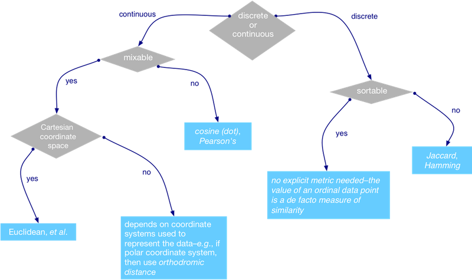
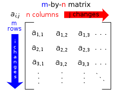
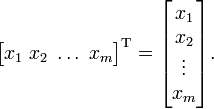

# Machine Learning with

	
    
                               _            __  __       _                 _   
        /\                    | |          |  \/  |     | |               | |  
       /  \   _ __   __ _  ___| |__   ___  | \  / | __ _| |__   ___  _   _| |_ 
      / /\ \ | '_ \ / _` |/ __| '_ \ / _ \ | |\/| |/ _` | '_ \ / _ \| | | | __|
     / ____ \| |_) | (_| | (__| | | |  __/ | |  | | (_| | | | | (_) | |_| | |_ 
    /_/    \_\ .__/ \__,_|\___|_| |_|\___| |_|  |_|\__,_|_| |_|\___/ \__,_|\__|
             | |                                                               
             |_|                                                               

	                             and
                                 __       
                 ________ ___   / /  ___  
                / __/ __// _ | / /  / _ | 
              __\ \/ /__/ __ |/ /__/ __ | 
             /____/\___/_/ |_/____/_/ | | 
                                      |/  Programming Language

Saleem Ansari (`@tuxdna`)

[http://tuxdna.in/](http://tuxdna.in/)

---

# Outline
## Mahout Algorithms
## Mahout Scala primitives
## Demo

---

# Apache Mahout Algorithms

Some use-cases:

 * **Product Recommendation**: understanding / inferring what your customers are looking for
 * **Topic Modeling**: identifying topics from documents
 * **Frequent Patterns Mining**: knowing which entities occur together very often
 * **Clustering**: grouping similar items or grouping very similar documents, which are perhaps talking about the same subject
 * **Regression and Classification**: predicting house prices, or identifying a class of an item viz. product, document, person etc.
 * And many more

---

# Basic Ideas

 * Similarity and Distance metrics
 * Vector and Matrices
 * Statistics
 * Probability

---

# Similarity / Distance metrics

Different Similarity metrics

 * Pearson correlation
 * Euclidean distance
 * Cosine measure
 * Spearman correlation
 * Tanimoto coefficient
 * Log likelihood test
 
Distance to Similarity conversion ( not the only way )

    s = 1 / ( 1 + d )

---

# Similarity / Distance metrics contd...

---

# Matrix

---

# Vector

---
# Statistics

What are the stats almost everyone knows?

 * mean / average / expectation
 * median
 * mode

---
# Probability

 * Conditional Probability: `P(A|B) = num(A intersection B) / num(B)`
 * Bayes Rule: `P(A|B) = P(B|A) / P(B)`
 * Probability Distribution: PMF for discreet, PDF for continuous variables

---

# Mahout Scala API

 * Vector
 * Matrix

---

# Demo

---

# What upcoming in Mahout 1.0 ?

* No further development in Map-Reduce ( Hadoop ) style, although existing algorithms will remain.
* Existing MR algorithms to be ported from MR1 to MR2.
* All the new algorithms will use Scala Math DSL which can be run seamlessly over Hadoop, Spark or anything else.

---

# Questions

---

# Thanks and happy coding :-)

---

# References

 * [Selecting an appropriate similarity metric & assessing the validity of a k-means clustering model](https://stackoverflow.com/questions/8102515/selecting-an-appropriate-similarity-metric-assessing-the-validity-of-a-k-means)
 * [Converting Similarity to Distance and vice-versa](http://stackoverflow.com/questions/4064630/how-do-i-convert-between-a-measure-of-similarity-and-a-measure-of-difference-di)
 * [Mahout Scala and Spark bindings](http://mahout.apache.org/users/sparkbindings/home.html)
 * [Multivariate Normal Distribution](http://en.wikipedia.org/wiki/Multivariate_normal_distribution)
